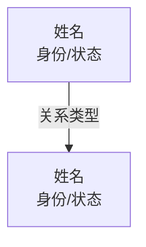

# Typer Dashboard — 创作数据看板

生成小说的全局鸟瞰：写作统计、人物关系图谱、卷进度追踪、科学设定覆盖率检查、角色活跃度健康检查。

## 触发时机

- 创作流程中的任意节点，用户想看「整体进度」时
- 每次卷终工序前，辅助定位数据盲区
- 角色长期未出场时，排查写丢风险

## Process

### 1. 上下文装载

- `1-思想实验/选题.md` — 标题与核心思想实验
- `0-角色档案/核心人物.md` — 角色列表、状态、关系
- `0-角色档案/关系图谱.md` — 角色间关系连线定义
- `5-剧情单元/` — 规划中的剧情单元结构
- `6-分章大纲/` — 分章大纲完成状态
- `4-分卷大纲/` — 卷级规划
- `2-世界观设定/世界观.md` — 世界观上下文
- `3-科学设定/科学设定.md` — 三层标注的科学设定列表
- `.claude/current-state.md` — 当前工作流位置、卷/单元进度
- `.claude/chapter-snapshot.md` — 章节元数据（关键事件、科学设定出场、角色-科学感知）

### 2. 数据聚合

- 扫描 `7-正文/` 下所有 `第*章.txt` 获取章节列表及字数
- 解析 `current-state.md` 获取当前卷号、单元号、workflow_step
- 解析 `chapter-snapshot.md` 表格，提取每章的科学设定出场和角色出场
- 运行 `python .claude/bin/typer-index.py stats` 获取机器层索引概览
- 从 `核心人物.md` 解析角色关系和状态
- 从 `关系图谱.md` 提取关系连线用于 Mermaid 图

### 3. 输出看板

完整渲染以下六个区块，直接输出到对话中。

---

## Output Template

```
# 📊 创作数据看板

## 一、工作流状态

| 指标 | 数值 |
|------|------|
| 当前阶段 | {workflow_step} |
| 当前卷 | 第{volume}卷 |
| 当前单元 | 第{unit}单元（第{start}-{end}章） |
| 机器层索引 | {向量数} 向量 / {章节数} 章节 |

**进度条**：{▮▮▮▮▮▮▯▯▯ 60%} → 根据 workflow_step 在完整链路中的位置计算

## 二、写作概览

| 指标 | 数值 |
|------|------|
| 总字数 | XXX 字 |
| 总章节 | XXX 章 |
| 平均每章 | XXX 字 |
| 最短章 | 第X章（XXX字） |
| 最长章 | 第X章（XXX字） |
| 已创建大纲 | X 个（覆盖第X-Y章） |

## 三、卷进度

| 卷 | 计划单元 | 已完成 | 计划章节 | 已写章节 | 进度 |
|----|---------|--------|---------|---------|------|
| 第1卷 | N | N | N | N | ████░░ 50% |

## 四、字数分布（每章趋势）

```
第1章  ████████████ 1800字
第2章  █████████████ 1950字
第3章  ██████████ 1600字
...
（可视章节数量简化为每5章取均值）
```

## 五、人物图谱

使用 Mermaid.js 格式输出，直接从 `关系图谱.md` 和 `核心人物.md` 提取：



## 六、科学设定覆盖率

| 三层标签 | 已定义 | 已在章节中出现 | 覆盖率 |
|---------|-------|--------------|-------|
| [已知科学] | N | N | XX% |
| [合理外推] | N | N | XX% |
| [核心假设] | N | N | XX% |

**未出现设定清单**：
- {设定名} — 已定义但至今未在任何章节出场
- {设定名} — 同上

（从 `chapter-snapshot.md` 的「科学设定出场」列与 `科学设定.md` 的条目交叉比对）

## 七、角色活跃度检查

| 角色 | 最后出场章节 | 当前状态 | 预警 |
|------|------------|---------|------|
| 主角 | 第X章 | ✅ 活跃 | - |
| 配角 | 第Y章 | ⚠️ 暂离 | 已N章未出场 |
| 反派 | 第Z章 | 🔴 冷却 | 已N章未出场（超过20章写丢预警） |

- **写丢预警**：超过20章未出场的角色标记🔴，建议安排回归
- **角色-科学感知**：从 chapter-snapshot 检查每个角色是否有「角色-科学感知」记录，无记录的角色可能缺少对核心科学概念的个体反应
- **新角色积压**：最近5章新登场角色过多（>3个），建议放缓

## 八、透视建议

基于以上数据的自动化建议：
- 字数异常：第X章明显偏短/偏长
- 节奏预警：连续多章字数下降可能意味着剧情在赶
- 角色健康：建议下单元安排{角色名}重新登场
- 科学设定空洞：未出现的设定如果接近核心假设边界，建议在后续章节中落地
- 工作流瓶颈：当前停留在 {workflow_step}，下一步建议 {next_action}
```

### 4. 输出要求

- 完整看板直接打印到对话
- Mermaid.js 关系图在 Claude Code 中原生渲染
- 若项目为空（无正文、无角色），输出精简版看板，只显示工作流状态和初始化建议
- 若 `.clark/clark.db` 可用，通过 `typer-index.py stats` 获取机器层数据辅助看板
