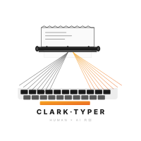

# Clark-Typer



**clark-typer** 是一个基于 Claude Code 的硬科幻创作框架。从思想实验到完整长篇的全程推演——选题论证、科学设定三层次标注、人物认知框架设计、章节级节奏控制、全局一致性扫描。每个与用户的交互节点均使用 `AskUserQuestion` 提供结构化选择。

## 核心特征

- **双轨架构** — 人类可读的 Markdown + sqlite-vec 语义索引。Git 追踪每一次修改，向量检索让机器理解内容。
- **三层标注引擎** — 每个科学设定强制标注为[已知科学]/[合理外推]/[核心假设]。从源头杜绝科学伪饰。
- **流程即代码** — 选题→设定→大纲→写作→审稿→修改，每个环节编码为自包含 Skill，输入输出明确可追溯。
- **快照层一致性扫描** — Append-only 章节元数据表，全局设定冲突检测先查索引再回溯全文，无需每次都通读。
- **可回溯的线性流程** — 不拒绝回退：大纲发现设定不足→补设定；写作发现人物立不住→回人物设计。每一步保留上下文，不丢进度。

## 快速上手

```bash
# 安装 Claude Code CLI（如已安装可跳过）
npm install -g @anthropic-ai/claude-code

# 进入项目并启动交互模式
cd clark-typer
claude

# 在交互模式中输入斜杠命令初始化项目
/typer-init
```

## 技能一览

### 工作流技能（按流程顺序）

| 指令 | 用途 | 阶段 |
|------|------|------|
| `/typer-init` | 项目初始化 / 重置 | 初始 |
| `/typer-topic` | 思想实验选题与创作意图对谈 | 设计 |
| `/typer-settings` | 世界观搭建 + 科学三层标注 + 哲学边界锚定 | 设计 |
| `/typer-character` | 人物画像、认知框架、叙事外化标记、关系图谱 | 设计 |
| `/typer-style` | 写作风格定义：语言密度、折射率策略、节奏量化指标 | 设计 |
| `/typer-structure` | 叙事结构设计、幕节奏框架（长篇模式） | 设计 |
| `/typer-research` | 科学文献查证、工程外推依据检索 | 设计 |
| `/typer-outline` | 分卷大纲 + 剧情单元 + 分章大纲（五维死锁） | 循环 |
| `/typer-writer` | 正文创作，POV 角色驱动叙事 | 循环 |
| `/typer-review` | 综合审稿：文学维度（结构、节奏、人物）+ 科学维度（物理、逻辑、标注合规） | 循环 |
| `/typer-editor` | 修改润色：精准修复审稿意见，最小动刀原则 | 循环 |
| `/typer-reader-review` | 读者盲读：模拟首次读者体验，心流评估 | 循环 |
| `/typer-consistency` | 全局设定一致性扫描：双层策略（快照初筛→语义回溯） | 收束 |
| `/typer-export` | 导出 TXT/EPUB/PDF | 收束 |
| `/typer-wrap` | 卷终工序：设定全息扫描、哲学审计、上下文收束 | 收束 |

### 基础架构技能（任意阶段可调用）

| 指令 | 用途 |
|------|------|
| `/typer-index` | sqlite-vec 语义索引：章节向量化、语义搜索、一致性预扫描 |
| `/typer-dashboard` | 创作数据看板：写作统计、人物图谱、卷进度、科学设定覆盖率 |

## 测试用例

项目内置三层自动化测试体系，用于验证工作流状态机、技能产出合约、内容质量约束和语义索引层。

```bash
# 全量运行
bash .claude/tests/runner.sh

# 快速验证（状态机 + 输出）
bash .claude/tests/runner.sh --quick

# 运行指定测试套件
bash .claude/tests/runner.sh --suite 01

# 报告与优化分析
bash .claude/tests/runner.sh --trend
bash .claude/tests/runner.sh --optimize
```

## 联系我

邮箱：[niyongsheng@outlook.com](mailto:niyongsheng@outlook.com?subject=Hi...)